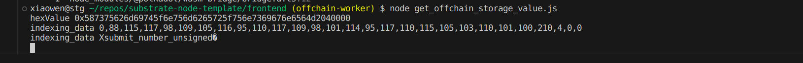
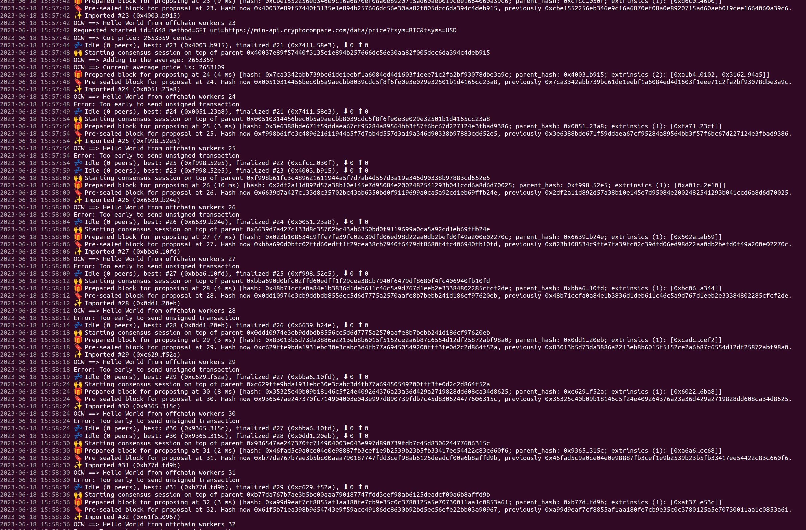
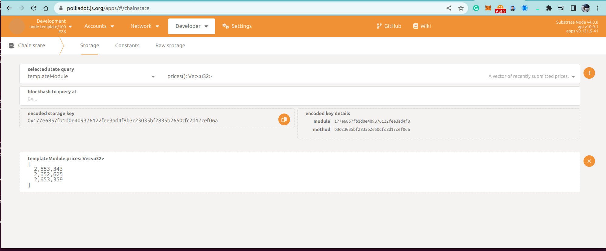

License: MIT-0

Q1: 链上随机数和链下随机数的区别？
链下随机数因为不需要被其他节点来验证，所以每个节点每次产生的随机数都可以不同，不需要可以被确定。
链上随机数必须可以由不同的节点反复验证，来确定此随机数出自于同一个发起者。

Q2: 在Offchain worker中，使用offchain indexing特性实现从链上向offchain storage中写入数据
运行
```
    cargo run -- --dev --enable-offchain-indexing true
```
1. Call write_offchain_extrinsic

2. Event OffchainStored is emitted


Q3: 使用js sdk从浏览器frontend获取到前面写入Offchain Storage的数据
运行
```
    npm install
    tsc get_offchain_storage_value.ts
    node get_offchain_storage_value.js
```
从Offchain Storage读到的值

TODO: decode the IndexingData

Q4. Send unsigned tx with signed payload


