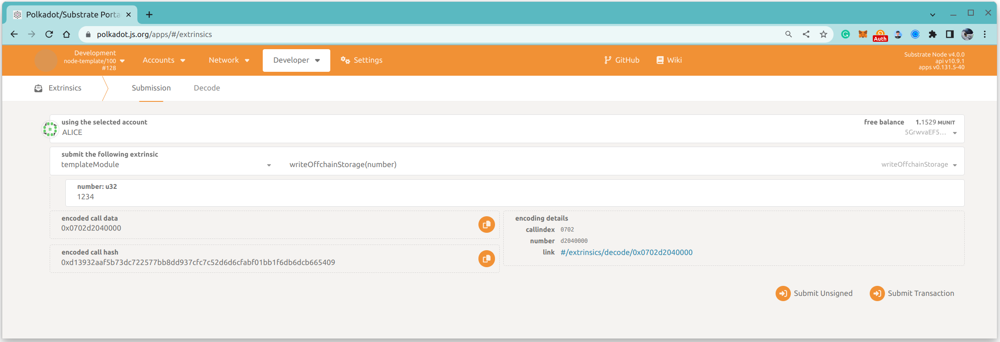
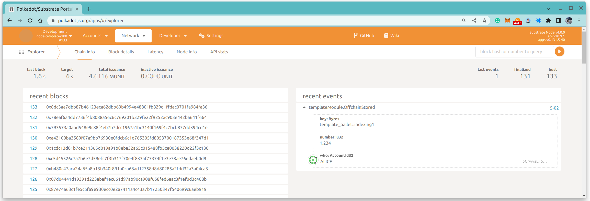

License: MIT-0

Q1: 链上随机数和链下随机数的区别？
链下随机数因为不需要被其他节点来验证，所以每个节点每次产生的随机数都可以不同，不需要可以被确定。
链上随机数必须可以由不同的节点反复验证，来确定此随机数出自于同一个发起者。

Q2: Use Offchain indexing on chain to store data to offchain storage
1. Call write_offchain_extrinsic

2. Event OffchainStored is emitted
